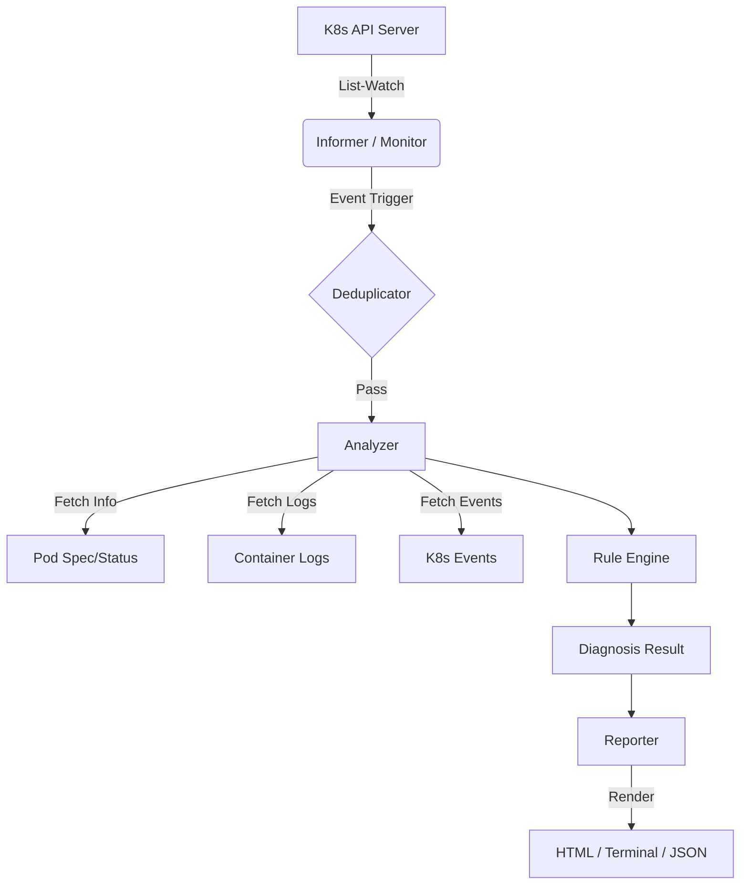

[](https://github.com/swfoodt/kubehealer/actions/workflows/ci.yaml)
# 🚑 KubeHealer

**KubeHealer** 是一个基于 Go 和 `client-go` 开发的 Kubernetes Pod 诊断与监控工具。它不仅对 Pod 进行**深度体检**（根因分析），还能**实时监控**集群状态，自动发现并记录故障现场。

与 `kubectl describe` 相比，KubeHealer 提供了更直观的 **HTML 可视化报告**、**日志正则分析** 以及 **历史故障回溯** 能力。

---

## ✨ 核心特性 (Features)

- **🔍 深度诊断 (Deep Diagnosis)**: 内置规则引擎，覆盖 OOM、CrashLoop、ImagePull、SchedulingFailed 及多种常见 Exit Code 和日志错误模式。
    
- **🧠 日志分析 (Log Analysis)**: 自动抓取容器日志，通过正则匹配识别 `Panic`, `Exception`, `Traceback` 等应用层错误。
    
- **👀 实时监控 (Real-time Monitor)**: 基于 Kubernetes **Informer** 机制，毫秒级感知 Pod 异常，自动触发诊断。
    
- **📊 多模态报告 (Multi-format Reports)**:
    
    - **HTML**: 包含时间轴 (Timeline) 的交互式网页报告。
        
    - **Terminal**: 运维友好的 ASCII 彩色表格。
        
    - **JSON/Markdown**: 易于集成到 CI/CD 或 Issue 文档中。
        
- **🛡️ 生产级特性**: 支持去重防抖 (Debounce)、配置热加载 (Viper)、Pprof 性能分析。
    
- **🌍 跨平台**: 提供 Windows, Linux, macOS 三端原生二进制文件。
    

---

## 📸 效果演示 (Demo)

### 1. 终端诊断


### 2. HTML 可视化报告


---

## 🚀 快速开始 (Quick Start)

### 安装 (Installation)

你可以直接从 [Releases](https://github.com/swfoodt/kubehealer/releases) 页面下载预编译的二进制文件。

或者使用源码编译：

```Bash
# 1. 克隆仓库
git clone https://github.com/yourname/kubehealer.git

# 2. 运行构建脚本 (自动注入版本信息)
# Windows (PowerShell)
.\build.ps1

# Linux / macOS
go build -o kubehealer ./cmd
```

### 使用 (Usage)

#### 1. 单次诊断 (Diagnose)

诊断某个具体的 Pod，并生成 HTML 报告：

```Bash
# 默认输出表格
./kubehealer diagnose crash-pod

# 输出 HTML 报告
./kubehealer diagnose crash-pod -o html
```

#### 2. 启动监控模式 (Monitor)

启动守护进程，监听 `default` 命名空间下的所有 Pod。一旦发现异常（如重启、OOM），自动生成报告。

```Bash
./kubehealer monitor -n default
```

#### 3. 查看历史报告 (Server)

启动内置 Web 服务器，在浏览器中查看所有历史诊断记录。

```Bash
./kubehealer server -p 8080
# 访问 http://localhost:8080
```

---
📚 **更多文档**:
- [详细安装指南 (Installation Guide)](docs/INSTALL.md)
- [完整使用手册 (User Manual)](docs/USAGE.md)
---

## ⚙️ 配置管理 (Configuration)

KubeHealer 支持通过配置文件管理参数。 运行以下命令生成默认配置文件 `~/.kubehealer.yaml`：

```Bash
./kubehealer config init
```

配置文件示例：

```YAML
monitor:
  namespace: "default"   # 监控的命名空间
  labels: "app=nginx"    # 标签选择器 (可选)
  interval: "5m"         # 全量同步间隔
```

---

## 🏗️ 技术架构 (Architecture)

KubeHealer 遵循 **Controller** 模式设计，核心由三部分组成：



📚 **更多介绍**:
- [架构设计文档 (Architecture)](docs/ARCHITECTURE.md)

---

## 🛠️ 开发与测试 (Development)

本项目包含完善的测试套件。

```Bash
# 运行单元测试
go test ./pkg/... -v

# 运行 E2E 集成测试 (需连接 K8s 集群)
# Windows
.\test\e2e\diagnose_test.ps1
```

---

## 📝 版本历史 (Changelog)

- **v0.0.0 (Dev)**: 完成核心诊断功能、Monitor 模式、日志分析、HTML 报告及交叉编译支持。
    

---

## 📄 License

MIT © 2025 swfoodt.