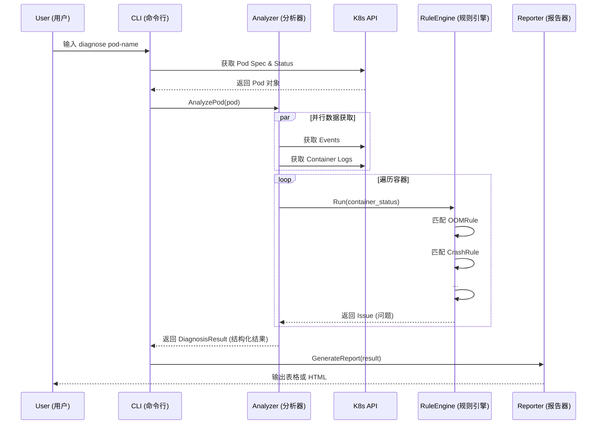
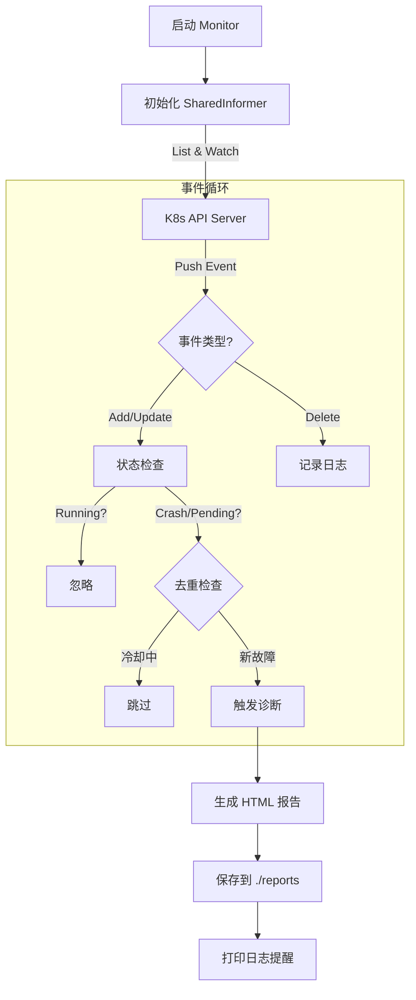

# 🏗️ 系统架构文档 (System Architecture)

本文档旨在帮助开发者和架构师理解 KubeHealer 的内部设计原理、代码组织结构以及核心工作流程。

## 1. 设计理念 (Design Philosophy)

KubeHealer 遵循 **"Pipeline" (流水线)** 和 **"Controller" (控制器)** 的设计模式：

* **分层架构**: 数据获取 (`k8s client`)、逻辑分析 (`analyzer`)、规则判断 (`engine`) 和 结果展示 (`reporter`) 严格解耦。
* **可插拔规则**: 所有的诊断逻辑都封装为独立的 `Rule`，通过接口与引擎交互，方便扩展。
* **事件驱动**: 监控模式基于 Kubernetes Informer 机制，实现毫秒级的故障响应。

## 2. 目录结构 (Directory Structure)

项目遵循标准的 [Go Project Layout](https://github.com/golang-standards/project-layout) 规范：

```text
kubehealer/
├── bin/                 # 编译产物
├── cmd/                 # 命令行入口
│   ├── diagnose.go      # 单次诊断命令逻辑
│   ├── monitor.go       # 监控模式命令逻辑
│   └── server.go        # Web 服务命令逻辑
├── pkg/                 # 核心库代码
│   ├── diagnosis/       # [核心] 诊断逻辑包
│   │   ├── analyzer.go  # 分析器主程序
│   │   ├── engine.go    # 规则引擎
│   │   └── rules.go     # 具体规则实现 (OOM, Crash...)
│   ├── k8s/             # K8s 客户端封装
│   ├── report/          # 报告生成 (HTML/Markdown/Table)
│   └── util/            # 通用工具函数
├── docs/                # 项目文档
├── test/                # 测试资源
│   ├── e2e/             # 端到端测试脚本
│   └── manifests/       # 测试用的故障 YAML
└── build.ps1            # 构建脚本
````

## 3. 核心流程图 (Core Workflows)

### 3.1 单次诊断流程 (Diagnose)

当用户运行 `kubehealer diagnose pod-name` 时：




### 3.2 实时监控流程 (Monitor)

当用户运行 `kubehealer monitor` 时，系统进入守护进程模式：




## 4. 扩展指南 (Extension Guide)

KubeHealer 的核心威力在于其可扩展的规则引擎。如果您想添加一种新的故障识别逻辑（例如检测 "Java Heap Space Error"），只需两步：

### Step 1: 实现 Rule 接口

在 `pkg/diagnosis/rules.go` 中创建一个新结构体，实现 `Rule` 接口：

```Go
type JavaHeapRule struct{}

func (r *JavaHeapRule) Name() string {
    return "JavaHeapRule"
}

func (r *JavaHeapRule) Check(pod *corev1.Pod, container *corev1.Container, status corev1.ContainerStatus) CheckResult {
    // 1. 检查是否是 Java 应用 (可选)
    // 2. 检查日志或状态是否包含 "OutOfMemoryError: Java heap space"
    // 3. 返回 CheckResult
    return CheckResult{Matched: false}
}
```

### Step 2: 注册规则

在 `pkg/diagnosis/engine.go` 的 `NewRuleEngine` 函数中注册您的新规则：

```Go
func NewRuleEngine() *RuleEngine {
    return &RuleEngine{
        rules: []Rule{
            &OOMRule{},
            &CrashRule{},
            &JavaHeapRule{}, // 新增规则
        },
    }
}
```

重新编译后，KubeHealer 就能识别新的故障类型了！